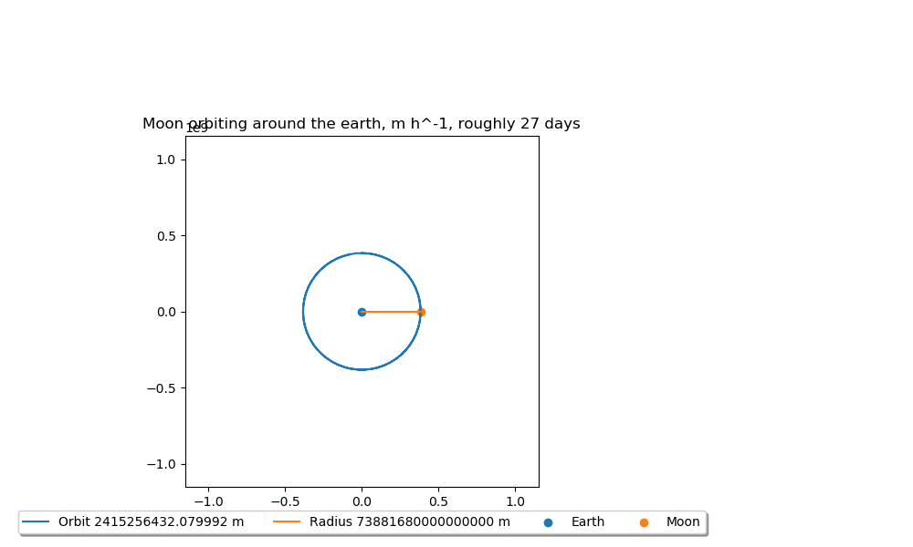

# IPASS: NKepler
This is the repository containing the IPASS project NKepler (short for not Kepler). Using the NKepler library you
can calculate circular orbits using Newton's second law.

The moon around the earth!

Mercury, Venus, Earth and Mars around the sun during one mars orbital period (circa 687 days)

