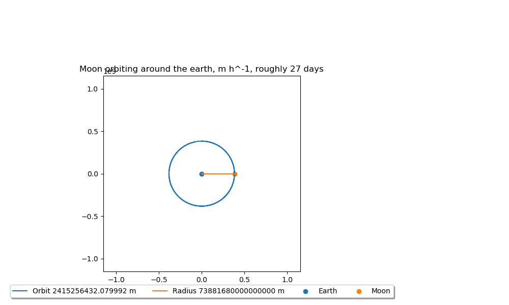

# IPASS: NKepler
This is the repository containing the IPASS project NKepler (short for not Kepler). Using the NKepler library you
can calculate circular orbits with Newton's second law.
## Library
You can find NKepler the library in the folder 'lib'. This contains the Python scripts 'classes' and 'utility'. Both are
necessary to use NKepler.

## Program
You can find the program in the folder 'app'. The program subsists of some simulation files. When executed, they display
an interactive Matplotlib.Animation window containing orbits of one or more Satellites. It is recommended to read the
simulation files before executing them.

## Documentation
You can find the documentation in the folder 'docs/_build/html'. To view them, download the specified folder and open 
'index.html'. This includes a basic tutorial

## Report
You can find the report, poster and formula booklet used to present NKepler in the folder 'report'. If you're interested
in learning about the design process of NKepler, or want to read more formal equations than the one in the documentation
, this is the place to be. 

## Examples:

The Moon around the Earth!

Mercury, Venus, Earth and Mars around the sun during one mars orbital period (circa 687 days)

The Moon around the Earth, around the Sun!

